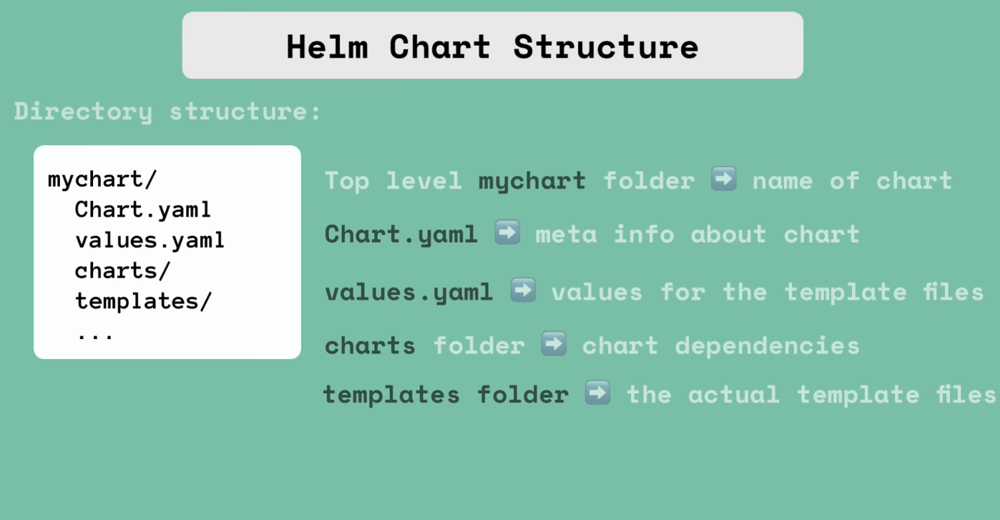
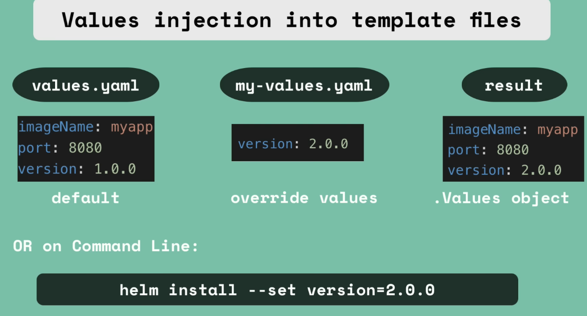

# What is Helm?
- Its a package manager for K8s
- Like npm or apt yum etc
- to package yaml files and distribute them in public and private repositories
- Bundle of yaml files 
- create your own helm charts with helm
- pusht o help repo
- downliad. and use existing ones
- Commnly used for DB apps, prometheus etc habe already charts available readily and reuse the configuration.
- `helm search <keyword>` or helm own public registries
- There are also public registries to share within in the organisations
- Its a templating engine
  - you can define a common blueprint
  - Dyanmic values which cna change you will have values which will be replaced by placeholders
  - and these values come from another yaml file called values.yaml file or via cli with --set flag
  - Its practical for CI/CD: in your build you can replace these values on the fly
- Same application across differnt envs
  - you can package them in your own chart and then redeploy in diff env using one cmd
  

>  `helm install <chartname>` after you run this, template files will be filled with the values from values.yaml
>
> Optionally you can have readme licensing etc

