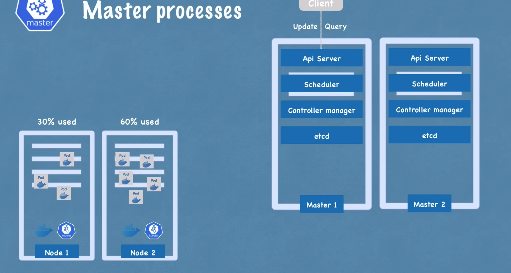

# Kubernetes Architecture Explained

## Table of Contents
1. [Worker Machine (Node)](#worker-machinenode-in-k8s-cluster)
2. [Interacting with the Cluster](#so-how-do-you-interact-with-this-cluster)
3. [Master Processes](#master-processes)
4. [Example Cluster Setup](#example-cluster-setup)

## Introduction
This document explains the architecture of a Kubernetes cluster, including the roles of nodes, master processes, and how they interact.

## WOrker Machine(Node) in k8s cluster
- Each node has multiple pods on it
- 3 process must be installed on every node
  - Container runtime (Docker or anyother tech)
  - Kubelet: interacts with both the container and node
    - kubelet starts the pod with a container inside.
    - And the way the communication happen between the pods is Service
  - Kube proxy : forwards the request
    - it wants to optimise the n/w call
- worker node does hte actual work

## So how do you interact with this cluster?

How to:
- scheduler pod?
- monitor?
- re-schedule/ re-start pod?
- join a new Node?

> these are all done by master NOdes

## Master processes
- 4 process run on every master node
  - API server
    - its like a cluster gateway
    - acts like a gate keeper for auth
    - One entry point to cluster
  - Scheduler
    - scheduler decides where to put the pod based on the req and check resources and check worker nodes and avalble resourc in each node and intelligently allocate the pod in that particular Pod
    - schduler get request and asks the kubelet of the node and then kubelt does the actual job
    - Scheduler just decides, rest is handled by kubelet
  - Controller Manager
    - if pods die in any node we need to detect that 
    - detects cluster state changes
    - and tries to recover the cluster state as soon as possible
    - for that it amkes a request to the scheduler and then asks it to restart or recreate and the schduler calls the kubelet for the request
  - etcd
    - etcd is the cluster brain
    - cluster changes get stored in the key value store
    - eg: how does the schduler know that what resource ar eavailble in each worker node or how does controller manger that which pod died or about the cluster health from the api server
    - Application data is NOT stored in the etcd
    - Its a cluster state information for the master process to communicate with worker processs and vice versa.
- In practice there are multiple master nodes and api server is load balanced and etcd are distributed storage across all the master nodes
- 

- example Cluster setup
  - 3 master nodes
  - 5 worker nodes
  - master needs less resources and worker needs more resources
  - 