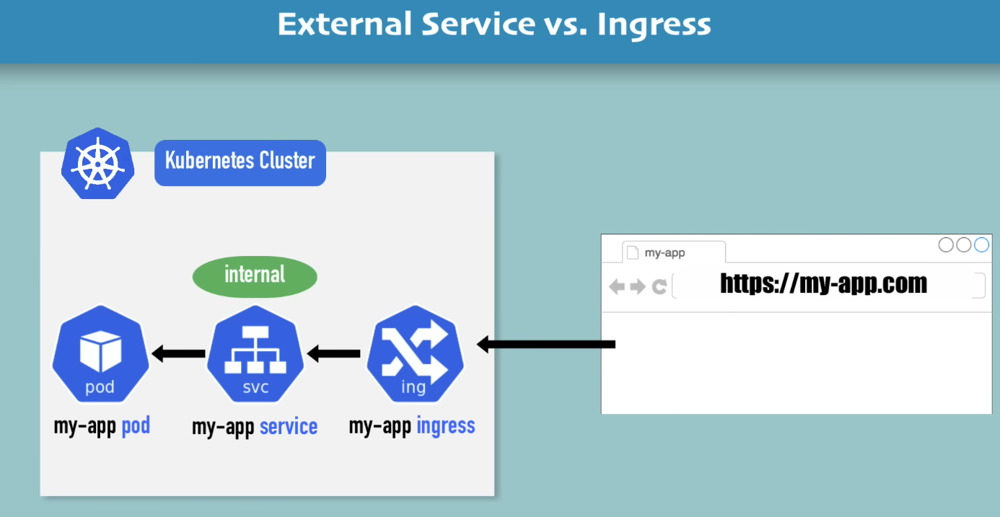
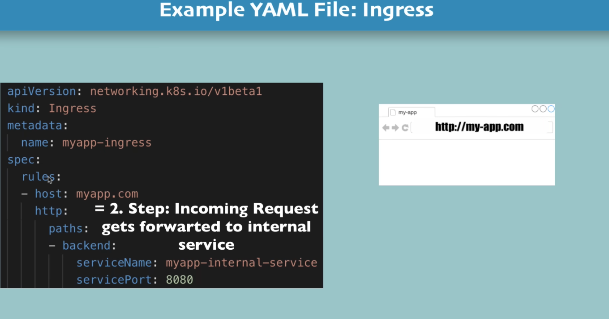
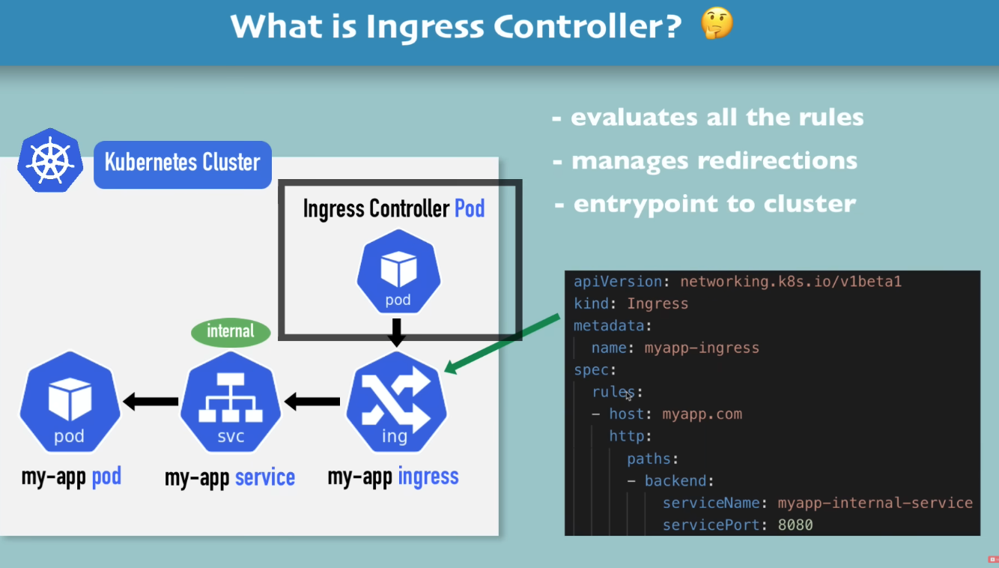
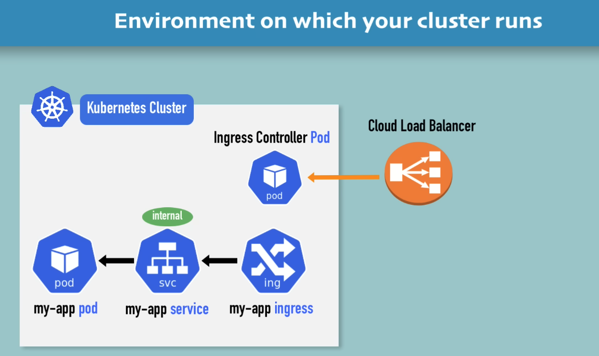
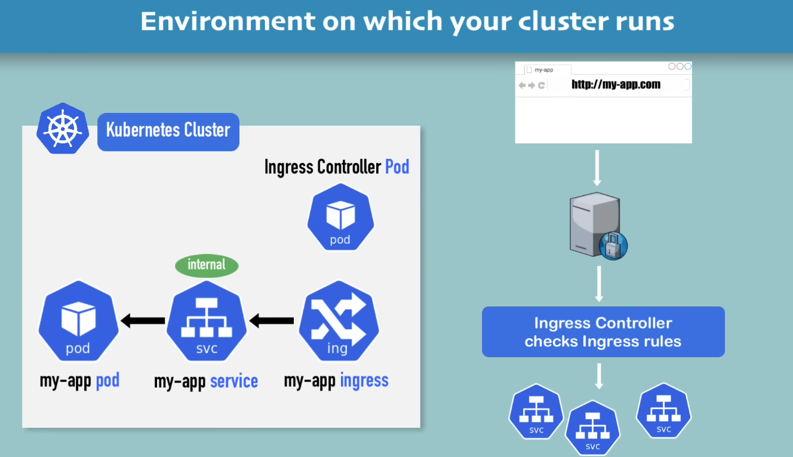
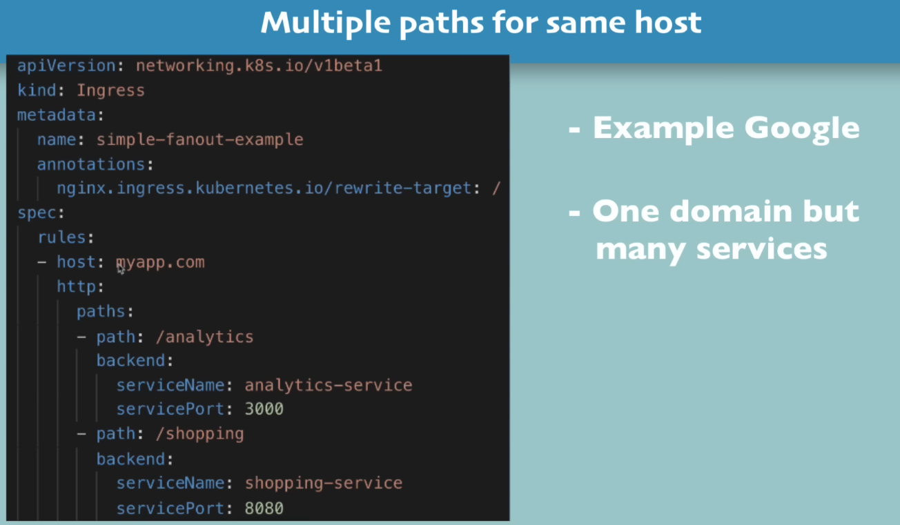
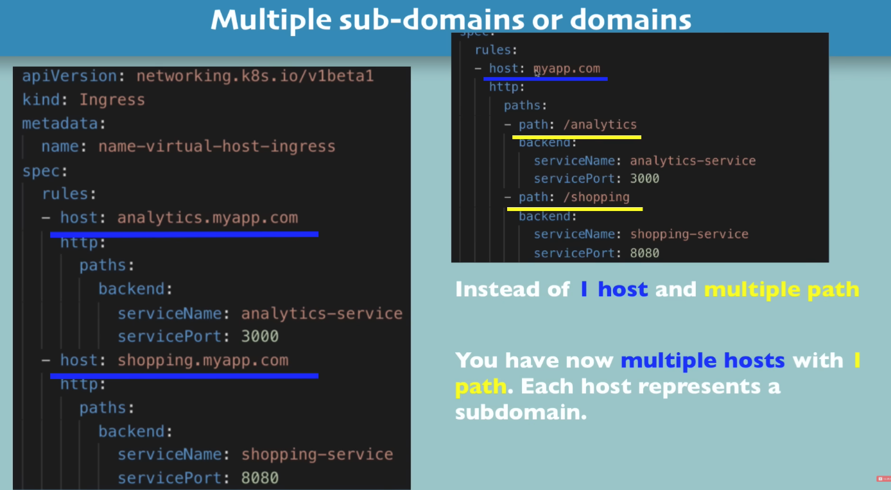
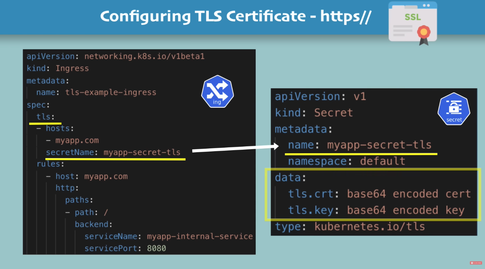

# Kubernetes Ingresss Explained

> Ingress conrtoller based on the rules specified in ingress checks the requests and forwards it 
> And manges redirections etc

- Usually for baremetal solutions without cloud we use a proxy server or a serpate server with public p address and open ports and entrypoint to cluster
- No server insde k8s cluster wilbe publicaly accessed 
- 

## To install ingress controller in minikube
 - `minikube addons enable ingress`
 - Automatically starts the k8s Nginx implementation of ingress controller

> /etc/hosts is the place where you can locally mention the mapping of the domain and ip such 127.1.2.3 app.com

- data keys need to be "tls.crt" and "tls.key" exactly
- Values are file contents NOT file paths location
- Secret compnent must be in the same namespace as ingress component
- 