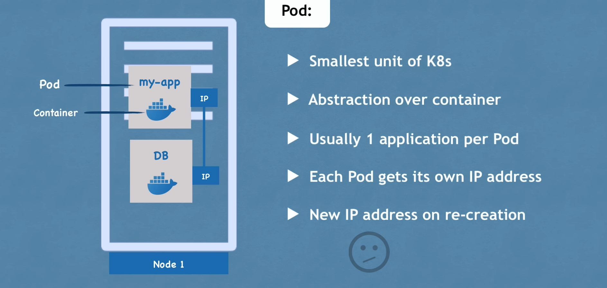

# Main Kubernetes Components

## Table of Contents
1. [Node](#node)
2. [Pod](#pod)
3. [Service](#service)
4. [ConfigMap](#configmap)
5. [Secret](#secret)
6. [Volume](#volume)
7. [Stateful Set](#stateful-set)

## Introduction
This document describes the main components of a Kubernetes cluster, including nodes, pods, services, and supporting resources.

## Node 

- simple physical or virtual machine

## Pod
- smallest uni of k8s
- abstraction over container
- usually 1 app per pod (but not necessarily)
- Each pod get its own IP address
  - If a pod dies a new one is created and a new IP is creatd and not necesarily we wiil always have the same IP for pods

## service
- permanent IP address
- lifecycle of pod and service NOT connected
  - External Service
    - whichcan be exposed to browser
  - Internal service 
    - which we dont want to expose to public something like the browser
- and once the serice is external it will look like ip address and we dont want to show that publically instead we it to look like my-app.com, for which we use another component called as ingress.
- and all the request go through the **ingress**.

## ConfigMap:
- external configuration of your application.

## Secret:
- used to store secret
- stored in base64 encoded
- the builr in security mech is not enabled by default
- this can be used in app as environment variables or as properties file
- 

## Volume
- Data storage
- 

## StateFul Set
- Deplpyment(or the blueprints) for Stales APPs
- StateFulSet for statefull apps or DB (But this is not Easy) Thats why we mostly host the DB outside the k8s cluster

