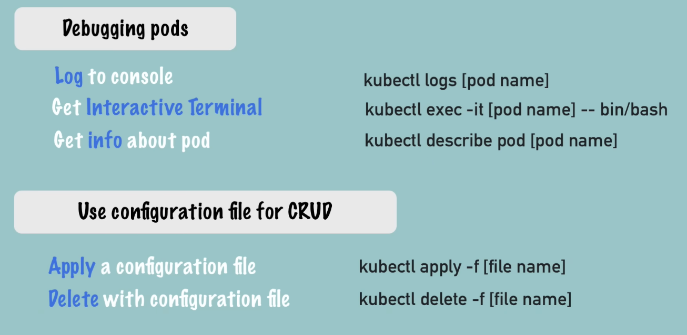
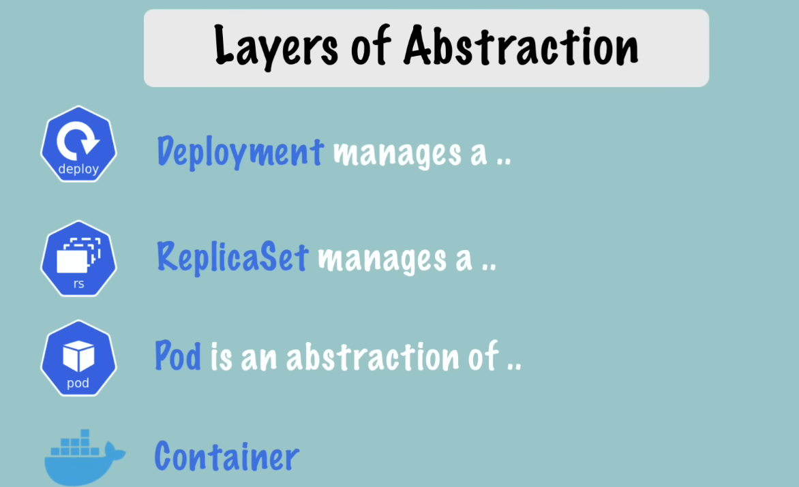

### install hyperhit and minikube
`brew update`

`brew install hyperkit`

`brew install minikube`

`kubectl`

`minikube`

### create minikube cluster
`minikube start --vm-driver=hyperkit`

`kubectl get nodes`

`minikube status`

`kubectl version`

### delete cluster and restart in debug mode
`minikube delete`

`minikube start --vm-driver=hyperkit --v=7 --alsologtostderr`

`minikube status`

### kubectl commands
`kubectl get nodes` for the status

`kubectl get pod` for checking the pods

`kubectl get services` for checking the services

`kubectl create deployment nginx-depl --image=nginx` this will create the deployment if already doesnt exist

`kubectl get deployment` to check the deployments

> The Pod name: nginx-depl-5fcbf6fffd-77k2k
>
> Is devided into 3 parts
> - first part is the deployment name and the second apr tis the hash of replicaset and 3rd is it own ID

`kubectl get replicaset` 
>replicaset is managing the replica

`kubectl edit deployment nginx-depl`

### debugging
`kubectl logs {pod-name}`

`kubectl exec -it {pod-name} -- bin/bash`

### create mongo deployment
`kubectl create deployment mongo-depl --image=mongo`

`kubectl logs mongo-depl-{pod-name}`

`kubectl describe pod mongo-depl-{pod-name}`

### delete deployment
`kubectl delete deployment mongo-depl`

`kubectl delete deployment nginx-depl`

### create or edit config file
`vim nginx-deployment.yaml`

`kubectl apply -f nginx-deployment.yaml`

`kubectl get pod`

`kubectl get deployment`

### delete with config
`kubectl delete -f nginx-deployment.yaml`

# Metrics

`kubectl top` The kubectl top command returns current CPU and memory usage for a cluster’s pods or nodes, or for a particular pod or node if specified.

